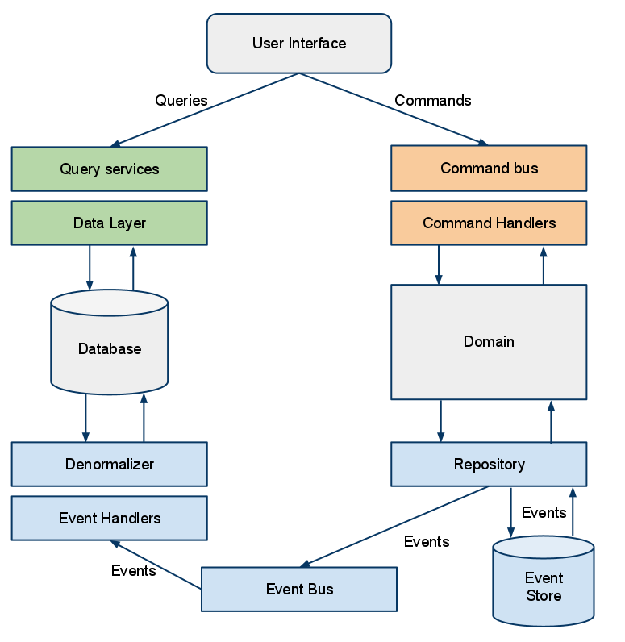
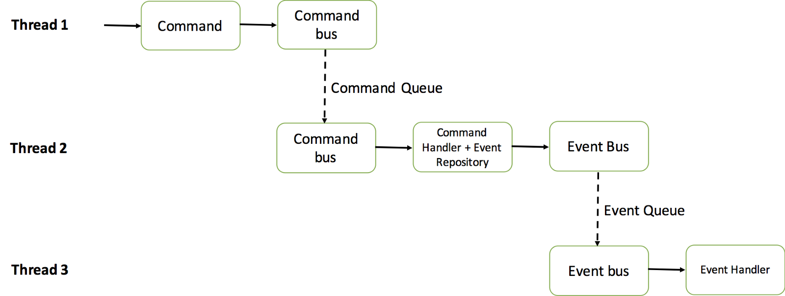

# Simple Implementation of event sourcing/CQRS pattern on a Power plant system

#### CQRS (Command and Query Responsibility Segregation)

     

* Command (_Write_): openTransaction, addPowerPlant, produce, consume

* Query (_Read_): histories, distributionByConsumptionProductionByType

#### Async

CommandBus
CommandHandler

EventBus
EventHandler

